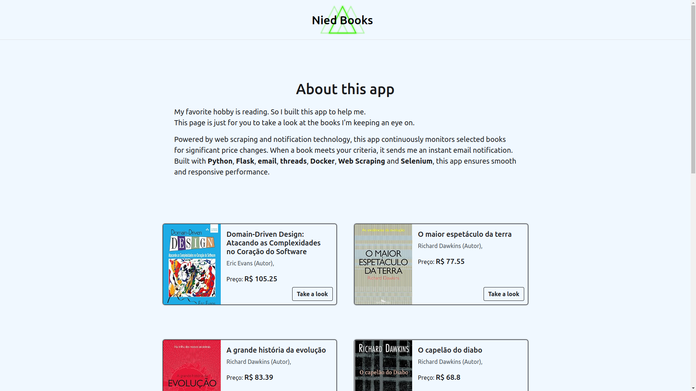

# Monitor Book Prices

My favorite hobby is reading. So I built this app to help me.

Powered by web scraping and notification technology, this app continuously monitors selected books for significant price changes. When a book meets your criteria, it sends me an instant email notification.
Built with Python, Flask, email, threads, Docker, Web Scraping and Selenium, this app ensures smooth and responsive performance.

## Images

<p align="center">
     
</p>


## Features

- **Add Books**: Users can add books to the monitoring list by providing the URL of the book from an online retailer.
  
- **Price Tracking**: The application periodically checks the prices of monitored books and updates the database with the latest prices.

- **User Interface**: A user-friendly interface allows users to view a list of monitored books and their current prices.

## Getting Started

### Prerequisites

- Python 3.x
- Flask
- Selenium
- SQLite

### Installation

1. Clone the repository:

```
git clone https://github.com/your-username/monitor-book-prices.git
```

2. Install dependencies:

```
pip install -r requirements.txt
```

### Usage

1. Run the Flask application:

```
python app.py
```

2. Access the application in your web browser at `http://localhost:5000`.

3. Use the interface to add books by providing their URLs.

4. The application will periodically check the prices of monitored books and update the database accordingly.

## Contributing

Contributions are welcome! Please fork the repository and submit a pull request with your changes.

## License

This project is licensed under the MIT License - see the [LICENSE](LICENSE) file for details.

## Acknowledgments

- This project was inspired by the need to track book prices across multiple online retailers.
- Special thanks to the Flask and Selenium communities for their excellent documentation and resources.

---

Feel free to customize this README to fit your project's specific details and requirements. Let me know if you need further assistance!

Colors
background: #1a1a1d
sub: #4e4e50
tertirary: #6f2232
Secondary: #950740
Primary: #c3073f